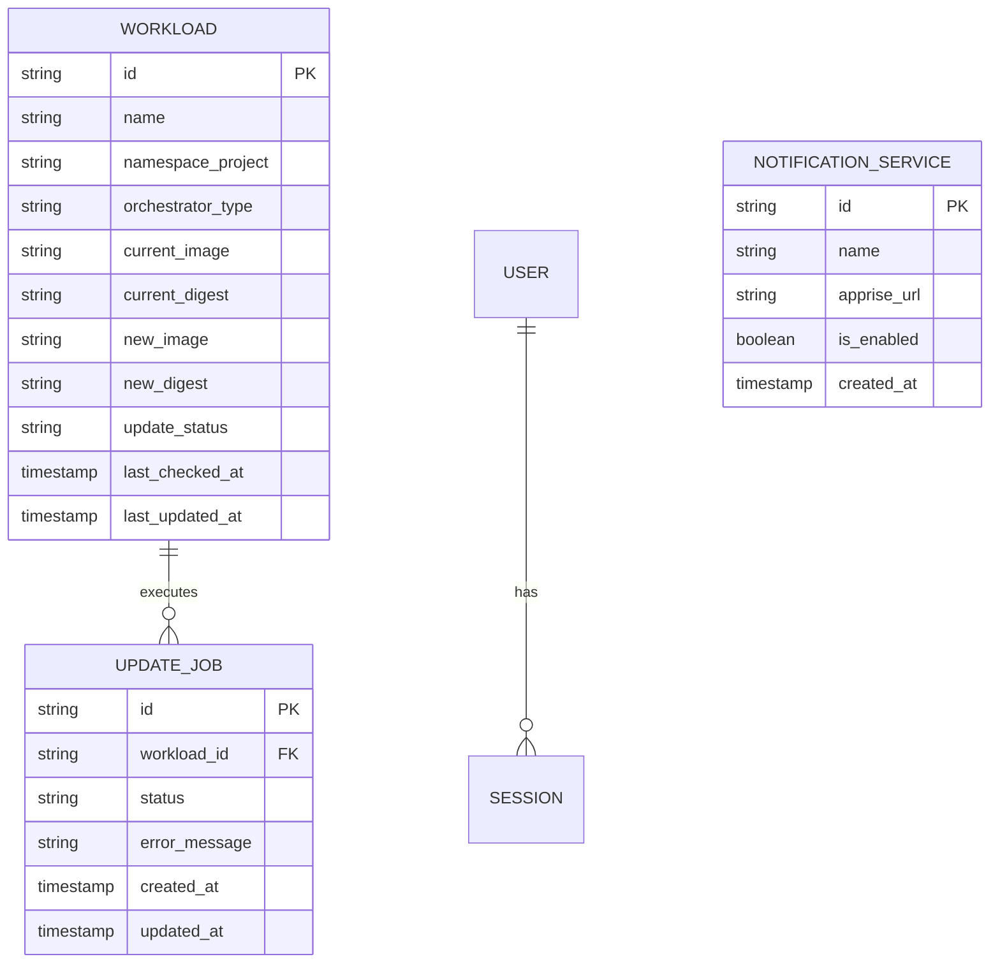

# Data Model: Container Updater

This document defines the logical data model and SQLite schema definitions for the `container-updater` application.

---

## 1. Entities & Schema Diagram



---

## 2. Table Schemas (SQLite syntax)

### 2.1. Workloads Table
Stores cached information about detected containers and Kubernetes workloads.
```sql
CREATE TABLE workloads (
    id TEXT PRIMARY KEY,                       -- Composite key or container UUID
    name TEXT NOT NULL,                        -- e.g. "nginx-frontend"
    namespace_project TEXT NOT NULL,           -- Compose project name or K8s namespace
    orchestrator_type TEXT NOT NULL,           -- "compose" or "kubernetes"
    current_image TEXT NOT NULL,               -- e.g. "nginx:1.25.0"
    current_digest TEXT NOT NULL,              -- SHA digest of current image
    new_image TEXT,                            -- e.g. "nginx:1.25.1" (if update exists)
    new_digest TEXT,                           -- SHA digest of new image
    update_status TEXT NOT NULL DEFAULT 'up_to_date', -- 'up_to_date', 'update_available', 'updating', 'failed'
    last_checked_at DATETIME,
    last_updated_at DATETIME
);
```

### 2.2. Update Jobs Table
Tracks asynchronous execution of manual updates triggered from the UI.
```sql
CREATE TABLE update_jobs (
    id TEXT PRIMARY KEY,
    workload_id TEXT NOT NULL,
    status TEXT NOT NULL,                      -- 'pending', 'in_progress', 'completed', 'failed', 'rolled_back'
    error_message TEXT,
    created_at DATETIME NOT NULL DEFAULT CURRENT_TIMESTAMP,
    updated_at DATETIME NOT NULL DEFAULT CURRENT_TIMESTAMP,
    FOREIGN KEY(workload_id) REFERENCES workloads(id) ON DELETE CASCADE
);
```

### 2.3. Notification Services Table
Stores Apprise integration endpoints.
```sql
CREATE TABLE notification_services (
    id TEXT PRIMARY KEY,
    name TEXT NOT NULL,                        -- e.g. "Telegram Admin Chat"
    apprise_url TEXT NOT NULL,                 -- e.g. "tgram://12345:ABCDE/12345"
    is_enabled BOOLEAN NOT NULL DEFAULT 1,
    created_at DATETIME NOT NULL DEFAULT CURRENT_TIMESTAMP
);
```

---

## 3. Data Validation Rules

1. **Workload State Transitions**:
   * Initial state: `up_to_date`.
   * If scheduler finds new image digest: transition to `update_available`.
   * If update triggered: transition to `updating`.
   * If update completes successfully: update `current_image`/`current_digest` and transition to `up_to_date`.
   * If update fails: transition to `failed`.

2. **Job Status Flow**:
   `pending` ➔ `in_progress` ➔ `completed` OR `failed` (OR `rolled_back` if automatic rollback occurred).
